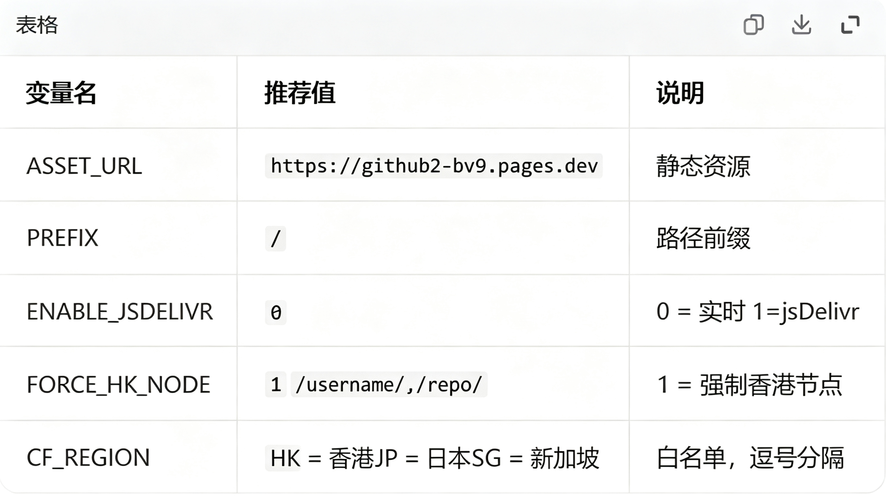

| **变量名**        | **推荐值**                | **说明**                                               |
|--------------------|---------------------------|--------------------------------------------------------|
| ASSET_URL          | https://xxxx.pages.dev    | 静态资源地址                                           |
| PREFIX             | /                         | 路径前缀 注意，少一个杠都会错！                        |
| ENABLE_JSDELIVR    | 0                         | 0=GitHub实时更新 1=jsDelivr（有缓存）                  |
| FORCE_REGION       | 1                         | 1=开启强制地区 0=关闭                                  |
| CF_REGION_CODE     | HK                        | HK=香港 / JP=日本 / SG=新加坡 / KR=韩国 / TW=台湾      |
| WHITE_LIST         | /username/,/repo/         | 白名单，逗号分隔                                       |

## 图片
{width=400px}
